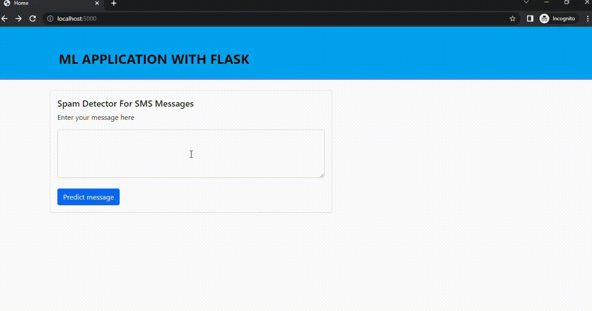

# 📩 SMS Spam Detector

A Flask-based web application that uses **Machine Learning** to classify SMS messages as **Spam** or **Ham** (not spam) in real-time.

Built with Python, scikit-learn, and Bootstrap.

---

## 🚀 Features

- **Real-time prediction** — Enter any SMS message and get an instant spam/ham classification
- **Naive Bayes classifier** — Trained on 5,572 SMS messages with **97.93% accuracy**
- **Clean web interface** — Bootstrap-powered responsive UI with animated result indicators
- **One-click startup** — Model trains automatically on server start, no manual setup needed

---

## 🛠️ Tech Stack

| Component | Technology |
|-----------|------------|
| Backend | Python, Flask |
| ML Model | Multinomial Naive Bayes (scikit-learn) |
| Feature Extraction | CountVectorizer (Bag of Words) |
| Frontend | HTML, CSS, Bootstrap 5 |
| Dataset | SMS Spam Collection (5,572 messages) |

---

## 📂 Project Structure

```
Spam-Detector-For-SMS-Message/
├── server.py                 # Flask app + ML model training & prediction
├── spam_data.csv             # SMS spam dataset (5,572 messages)
├── requirements.txt          # Python dependencies
├── sms-detector-EDA.ipynb    # Exploratory Data Analysis notebook
├── templates/
│   ├── home.html             # Input form page
│   └── result.html           # Prediction result page
└── static/
    ├── css/
    │   ├── styles.css        # Main stylesheet
    │   ├── alert-spam.css    # Spam alert animation
    │   └── alert-ham.css     # Ham checkmark animation
    ├── js/
    │   └── styles.js         # Form validation
    └── images/
        └── spam-detec.gif    # Demo animation
```

---

## ⚡ Getting Started

### Prerequisites

- Python 3.8 or higher
- pip (Python package manager)

### Installation

1. **Clone the repository**

```bash
git clone https://github.com/fermat01/Spam-Detector-For-SMS-Message.git
cd Spam-Detector-For-SMS-Message
```

2. **Install dependencies**

```bash
pip install -r requirements.txt
```

3. **Run the application**

```bash
python server.py
```

4. **Open in browser**

```
http://localhost:5000
```

---

## 📊 How It Works

1. **Data Loading** — The app reads `spam_data.csv` containing labeled SMS messages
2. **Feature Extraction** — Text is converted to numerical features using `CountVectorizer` (Bag of Words model)
3. **Model Training** — A Multinomial Naive Bayes classifier is trained on 67% of the data at startup
4. **Prediction** — User input is vectorized and classified as spam (1) or ham (0)

### ML Algorithms Explored (in EDA notebook)

- Naive Bayes Classification ✅ *(used in the app)*
- Random Forest Classification
- Bagging Classification
- Extra Tree Classification
- Decision Tree Classification
- KNeighbors Classification
- SVM Classification

---

## 🎬 Demo



---

## 📋 Dependencies

```
Flask==2.2.2
pandas==1.5.2
scikit-learn==1.2.0
joblib==1.2.0
```

---

## 📄 License

This project is open source and available under the [MIT License](LICENSE).
